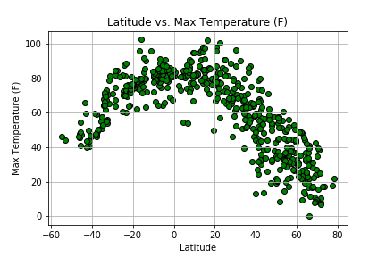
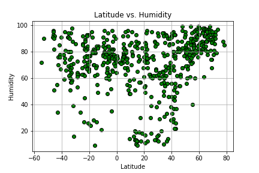
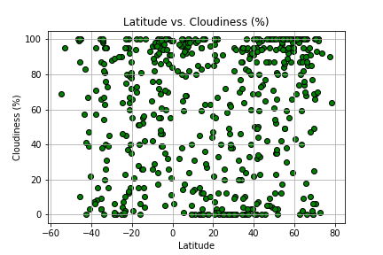
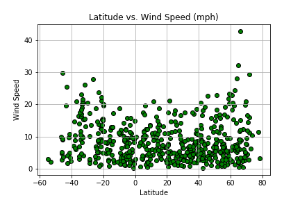
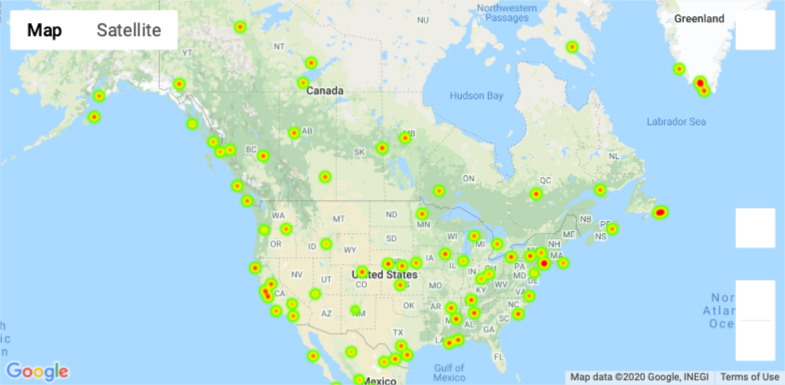
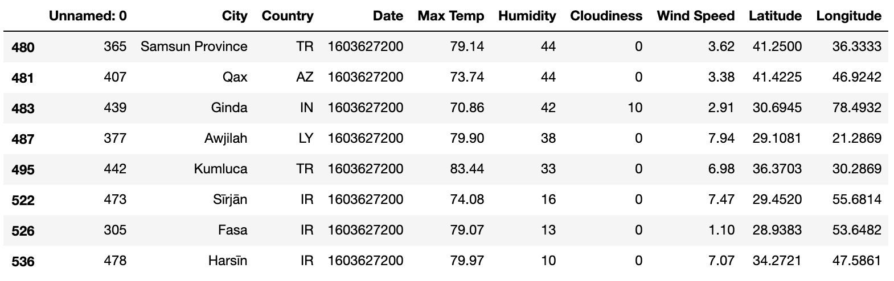
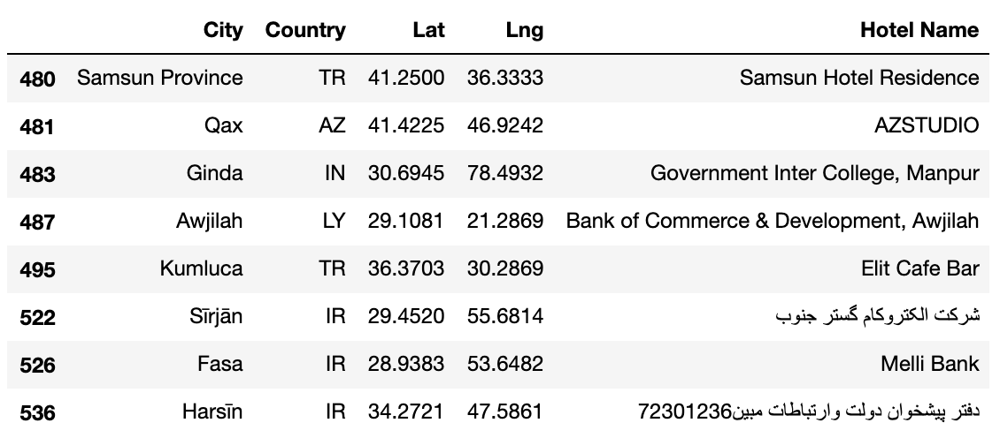
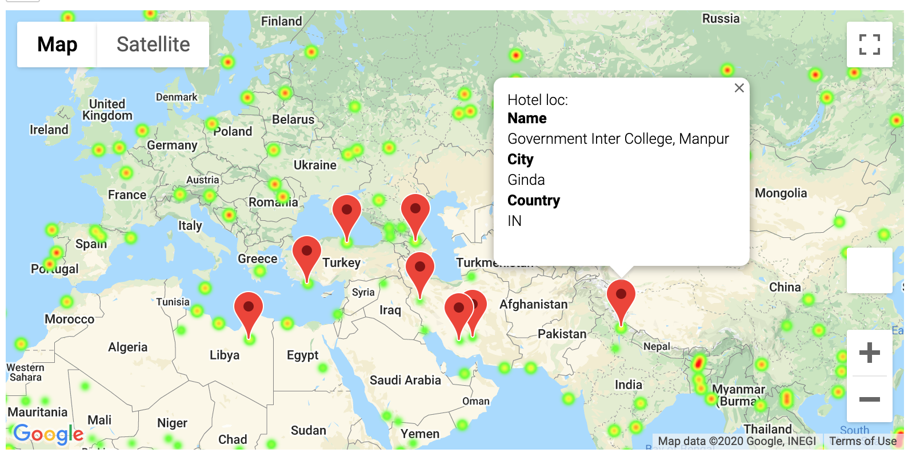

## API-Challenge
GT Data Bootcamp - Python API HW_Rios

## Part I: WeatherPy 

This analyis visualizes the weather of 500+ cities across the world of varying distance from the equator and creates a representative model of weather across world cities. This analysis utilizes a [simple Python library](https://pypi.python.org/pypi/citipy), and the [OpenWeatherMap API](https://openweathermap.org/api).

## City Weather: Observable Trends
* There are strong correlations between latitude and max temperature (F) in both hemispheres (see figure 1 and linear regression models).  In the Northern Hemisphere there is a strong negative correlation (r = -0.88) between latitude and max temperature (F), as a city's latitude increases the temperature decreases.  In the Southern Hemisphere there is a strong positive correlation (r = 0.70) between latitude and max tempearture (F), as a city's latitude increases the temperature also increases. 
* Cities that are closer to the equator have a visible increase in max temperture (F) while cities that are farther away have a visible decrease in max temperture (F) (see linear regression models and r values)
* There are no statistically significant differences in latitude and other weather data, such as humidity, cloudiness and wind speed for both hemispheres (see linear regression models and r values).  

## City Weather Data Scatter Plots
A series of scatter plots were created to showcase the following relationships:

* Temperature (F) vs. Latitude

* Humidity (%) vs. Latitude

* Cloudiness (%) vs. Latitude

* Wind Speed (mph) vs. Latitude

## Linear Regressions and r values: Northern Hemisphere and Southern Hemisphere

Linear regressions were run on each weather relationship analyzed above, separated into Northern Hemisphere (greater than or equal to 0 degrees latitude) and Southern Hemisphere (less than 0 degrees latitude):

* Northern Hemisphere - Temperature (F) vs. Latitude: The r-squared is: -0.8592238867153817
    * Observation: strong negative correlation (r value = -0.88), in N. Hem as Lat increases max temp decreases, moving away from the equator

* Southern Hemisphere - Temperature (F) vs. Latitude: The r-squared is: 0.7875847756781865
    * Observation: strong positive correlation (r value = 0.70), in S. Hem as Lat increases max temp increases moving toward the equator

* Northern Hemisphere - Humidity (%) vs. Latitude: The r-squared is: 0.3838341812978543
    * Observation: weak correlation (r = 0.4), as in N. Hemisphere lat increases humidity slightly increases for some cities

* Southern Hemisphere - Humidity (%) vs. Latitude: The r-squared is: -0.031845085294373174
    * Observation: no correlation (r = -0.026), in S. hemisphere as lat increases no trends in humidity

* Northern Hemisphere - Cloudiness (%) vs. Latitude: The r-squared is: 0.17910511898832548
    * Observation: no correlation (r = 0.18), in N. hemisphere as lat increases no stat sig trend in cloudiness

* Southern Hemisphere - Cloudiness (%) vs. Latitude: The r-squared is: 0.13547446780170858
    * Observation: no correlation (r = 0.025), in S. hemisphere as lat increases no stat sig trend in cloudiness

* Northern Hemisphere - Wind Speed (mph) vs. Latitude: The r-squared is: 0.11833184012503009
    * Observation: no correlation (r = 0.099), in N. hemisphere as lat increases no stat sig trend in wind speed

* Southern Hemisphere - Wind Speed (mph) vs. Latitude: The r-squared is: -0.2632670376686728
    * Observation: no correlation (r = -0.22), in S. hemisphere as lat increases no stat sig trend in wind speed

## Part II - VacationPy

This analysis works with weather data to plan future vacations using jupyter-gmaps and the Google Places API.

### Humidity Heatmap

* Heat map created that displays the humidity for every city from the part I Weatherpy.

### Cities with ideal weather conditions:

  * Ideal weather conditions: 
    * A max temperature lower than 85 degrees but higher than 70.
    * Cloudiness is lower or equal to 20%
    * Humidity is lower or equal to 30%
    * Wind speed less than 10 mph.

* Using Google Places API to find the first hotel for each city located within 5000 meters of your coordinates.

* Plot the hotels on top of the humidity heatmap with each pin containing the **Hotel Name**, **City**, and **Country**.

